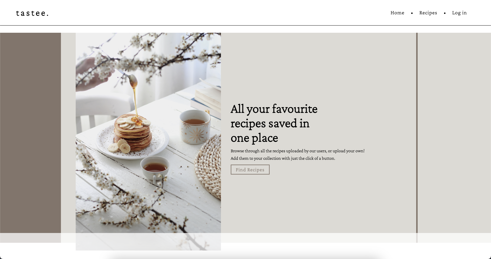
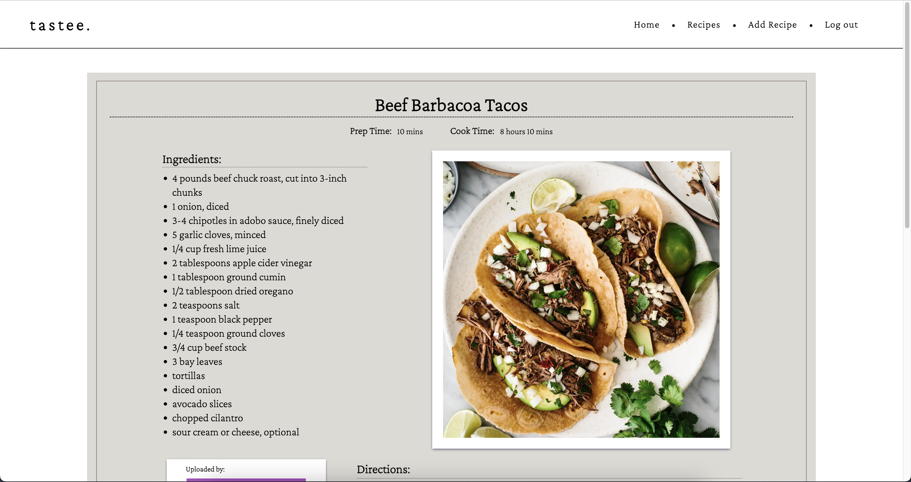

# tastee.

tastee. is a full CRUD web application that allows users to browse through different recipes uploaded by other users, as well as upload their own. Users are able to save recipes to their profile to be able to come back to and see a list of all their saved recipes. Users are also able to leave reviews with ratings on each recipe.

Each recipe includes the title of the recipe, the amount of time it takes to cook as well as the amount of preparation time required. An image of the final result, with both all the ingredients and directions to follow. 

tastee. utilizes Google OAuth to provide basic authentication giving users access to specifc features, such as deleting their reviews or recipes themselves, as well as editing any recipe that they have uploaded.
## Screenshots

## Technologies Used

- HTML
- CSS
- JavaScript
- EJS
- Node.js / Express.js
- MongoDB / Mongoose
- GitHub

## Getting Started
The website can be found here: https://tastee-410.herokuapp.com/

All you need to do is click login at the top right corner, and that will give you access to being able to upload recipes, review other recipes(or if you really wanted to, your own recipe), edit/delete your own recipes, and save recipes to your profile page.

## Next Steps

Things I would like to add in the future are:

#### A Responsive Design
- I would like to refactor the design to make it more responsive. I was running out of time and had to meet the deadline, and so currently the site looks the way I want it to, specifically on a 15" Macbook screen. Ideally in the future, I would like implement media queries to provide a more responsive design, and possibly in the future, have a mobile design too.

#### Profile Page

- I would like to add the profile page in near future. I had to meet the MVP and was running low on time and so I had to skip out on that part for now. I'd like the profile page to display the user's info card, similarly to how it is on the recipe details page, but with additional stats: "Recipes Uploaded" and "Recipes Saved". As well as including two different sub areas that displays a list of all the users uploads, and then the second tab would display all of the users saved recipes, similar to their own virtual cookbook.

#### Search / Sort Functionality

- I would like to add a search bar that allows users to search for different keywords that would help them find certain recipes faster. Additionally I would like to add the ability to sort the recipes. Whether it be by the type of food, or by the date the recipe was uploaded.

#### Search / Sort Functionality

- I would like to implement some sort of API to the site. I was thinking about using some sort of API if it exists to fetch different recipes at random, allowing the user to find random recipes if they're feeling adventurous.  

